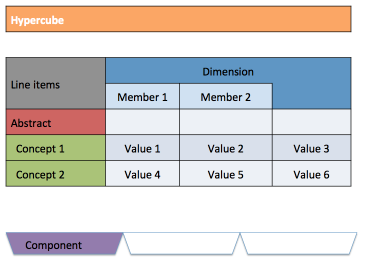
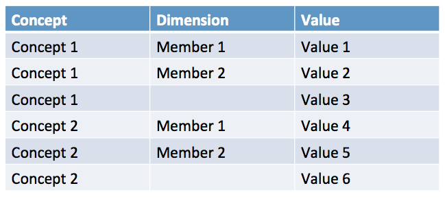

##Analogy With spreadsheets

For users used to spreadsheet software such as Excel, the following table shows a rough correspondence between the two paradigms.

| Cell store     | Spreadsheet                         |
|----------------|-------------------------------------|
| Entity         | User                                |
| Archive        | Excel file                          |
| Component      | Sheet                               |
| Fact           | Data cell                           |
| Report element | Header cell                         |
| XBRL syntax    | Internal structure of an Excel file |
| Fact table     | Raw display of a pivot table        |

###Spreadsheet View
Below is a spreadsheet-like representation of a component that shows how its report elements map to a spreadsheet:

###Fact Table View
Below is the fact table representation of this same spreadsheet. Typical spreadsheet software such as Excel are able to convert it automatically to the view above (pivot table).

